# A website for online exam

- All codes are available on https://github.com/I-mm/OnlineExam

- Meanwhile, it is also deployed on a server provided by [Aliyun](https://cn.aliyun.com/), and you can access this system on http://www.youhear.me:8080/ (Or directly IP address: http://39.105.165.114:8080/). *(**Note:** The server will expire at the end of Jan, 2019, and the domain name provided in the GitHub Student Developer Pack will also expire at Mar, 2019, so it may be not available after that time.)*

   

## Configuration

- Server: 1 Intel(R) Xeon(R) CPU E5-2682 v4 @ 2.50GHz, RAM 2GB, Ubuntu 16.04
- Container: Apache Tomcat 9.0.13
- Database: MySQL Ver 14.14 Distrib 5.7.24, for Linux (x86_64) using  EditLine wrapper

 

## Overview

This website TMP (Test Make Perfect) is an online English testing platform. Users can log in and register to visit our website and conduct online English testing. Before the test, users can set the pass line to satisfy their personal needs. During the test, the website will randomly call up a series of questions from the database, and timing the answering process. The website has the corresponding re-exam mechanism and the corresponding score algorithm for the time-out behaviour of the first test. After the end of the test, the website will generate the user’s scores, answer time, correct answers and so on. Users can also go back to the home page to see the results report.

 

## Function implementation

1. Question Library

   The question library contains 25 questions and the correct answers based, it is stored in MySQL database. 

   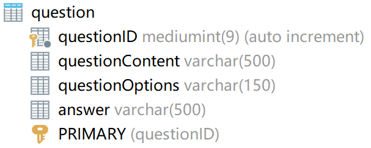

   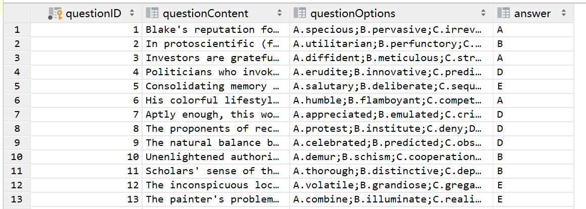

2. Exam generation

   Five questions and the corresponding choices are selected randomly from the question library. 

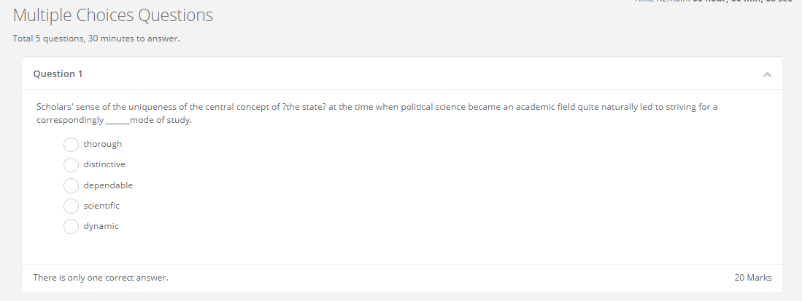

3. Setting of the score threshold

   Before starting the exam, the user can set the score threshold as his wishes by clicking the element, whose default value is 60.
   

4. Logic of the first attempt

   When user start an exam, the backend will select the questions randomly from the database and generate the test page. Users are required to select the correct answer and complete the test within the specified time. If the user finish the test in time and submit, the website will turn to the exam report page. 
   

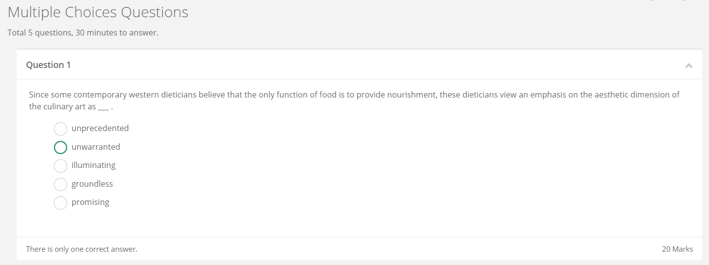

5. Re-exam logic 

   If the user fails to complete the first test within the specified time, the website will pop up an alert to let users do this test again. The final score is generated by the average of the two marks. After the second test, the website will jump to the exam report page and will not have third chance.

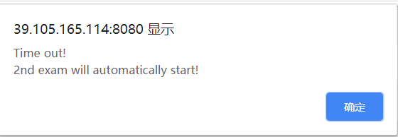

6. Exam report

   After the exam is over, the system will submit the answer sheet to the server which is responsible to calculate the final grade and send the relevant data back to the client.
   

   Two kinds of exam reports will be generated for the whole exam (including re-exam activities). One is focusing on the statistical analysis, while the other gives the detailed analysis report for each question and corresponding answer. 

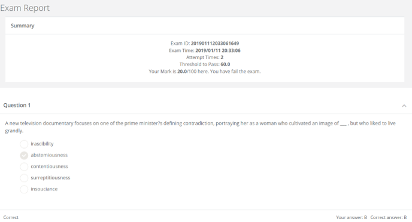

7.  Previous report

   Users can also view their previous exam reports by clicking the `My
   Previous Exam Report` button at `home_page.jsp`, then a table of previous reports will generated as shown below. 

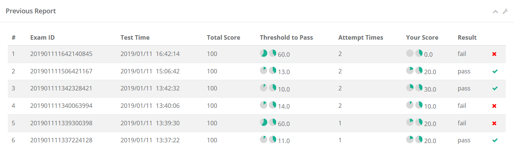

## User Interface

1. Login

   This is the first page of TMP. In this page, users can enter the username and password to login. If don’t have an account, users can click the button named ‘Create an account’ and jump to another page to complete register.
   

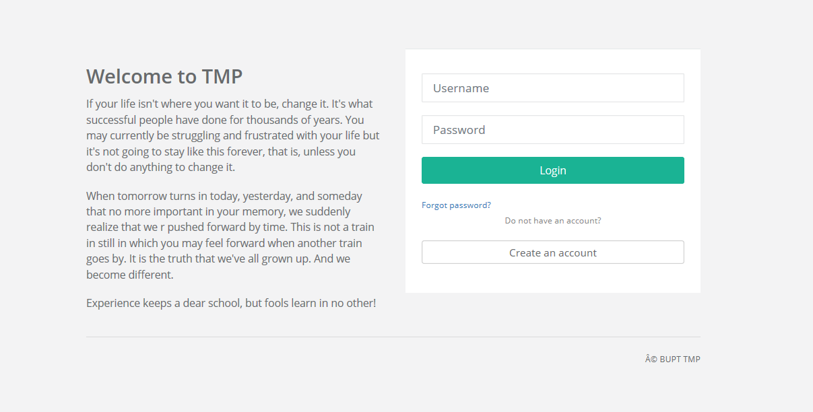

2. Register

   In this page, users can enter the Corresponding information and agree our terms and policy to finish register. After that, users can back to the last page to login.

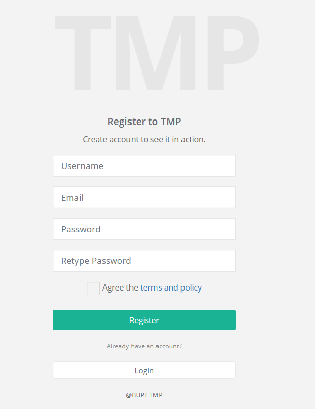

3. Home page

   When user entering the home page of TMP, they can see the following page which contains the user’s personal information, the start-test button, the watch-report button and the other blocks in our website.

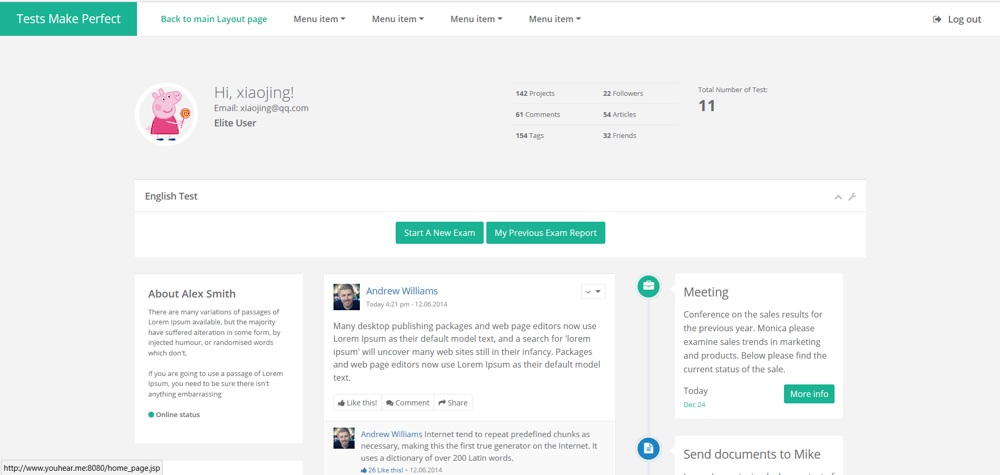

4. Set the score threshold

   After clicking the *Start a New Exam* button, users can see a modal box where can set the pass line by clicking the round. 
   

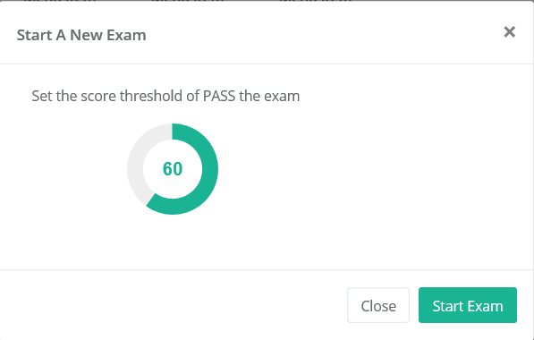

5. Exam page

   When user start an exam, the backend will select the questions randomly from the database and generate the test page. Users are required to complete the test within the specified time. If the user fails to complete the first test within the specified time, we will give another chance. 
   
     

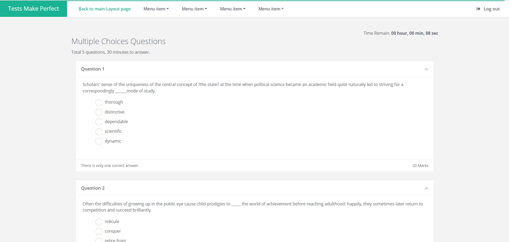

6. Exam report page

   In this page, users can see the mark, the exam time and so on. Following the summary, users can see the user’s answer and the correct answer.
   

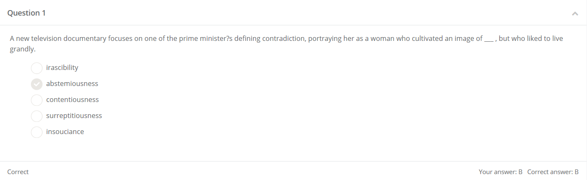

7. Previous report page

   Users can view their previous report by clicking the *My Previous Exam Report* button. In this page, users can see some information and Statistics from previous exams.

## Group Member

赵屹铭，赵春宇，井长源，张丙驰，夏昕